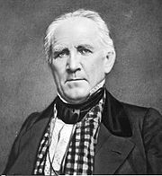

# Хьюстон

**Хьюстон** (англ. Houston) — четвёртый по количеству жителей город в Соединённых Штатах Америки и крупнейший город в штате Техас с населением 2 325 502 человека на 1.07.2018 года. Хьюстон является административным центром округа Харрис, а также главным экономическим центром агломерации Большого Хьюстона с общим населением 6 997 384 человек на 1.07.2018 года (5 место по США). Город располагается в 50 километрах от Мексиканского залива на прибрежной равнине.

Хьюстон был основан 30 августа 1836 года и включён в состав республики Техас 5 июня 1837 года, получив своё имя в честь Сэмюэла Хьюстона — главнокомандующего армией Техаса во время Техасской революции и президента Республики Техас. Быстрое развитие порта и железных дорог в XIX веке, а также начало добычи нефти и последовавшее развитие нефтяной промышленности в XX веке привели к быстрому росту населения. В 1960-е годы количество жителей превысило один миллион человек, а в 2000-е — два миллиона.

Город является ведущим мировым центром энергетической промышленности, а экономика города также представлена предприятиями в области аэронавтики, транспорта и здравоохранения. Важнейшими объектами для экономики и инфраструктуры города являются космический центр имени Линдона Джонсона, крупнейший американский по международным грузоперевозкам порт, хьюстонский судоходный канал, крупнейший в мире Техасский медицинский центр.

## История

### Этимология, прозвища

Город назван в честь Сэмюэла Хьюстона — главнокомандующего армией Техаса во время Техасской революции (1835—1836) и президента Республики Техас (1836—1838, 1841—1844).
