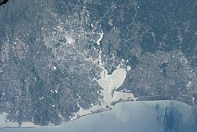

# Хьюстон

**Хьюстон** (англ. Houston) — четвёртый по количеству жителей город в Соединённых Штатах Америки и крупнейший город в штате Техас с населением 2 325 502 человека на 1.07.2018 года. Хьюстон является административным центром округа Харрис, а также главным экономическим центром агломерации Большого Хьюстона с общим населением 6 997 384 человек на 1.07.2018 года (5 место по США). Город располагается в 50 километрах от Мексиканского залива на прибрежной равнине.

Хьюстон был основан 30 августа 1836 года и включён в состав республики Техас 5 июня 1837 года, получив своё имя в честь Сэмюэла Хьюстона — главнокомандующего армией Техаса во время Техасской революции и президента Республики Техас. Быстрое развитие порта и железных дорог в XIX веке, а также начало добычи нефти и последовавшее развитие нефтяной промышленности в XX веке привели к быстрому росту населения. В 1960-е годы количество жителей превысило один миллион человек, а в 2000-е — два миллиона.

Город является ведущим мировым центром энергетической промышленности, а экономика города также представлена предприятиями в области аэронавтики, транспорта и здравоохранения. Важнейшими объектами для экономики и инфраструктуры города являются космический центр имени Линдона Джонсона, крупнейший американский по международным грузоперевозкам порт, хьюстонский судоходный канал, крупнейший в мире Техасский медицинский центр.

## Содержание

1. [История](#история)
    1. [Этимология, прозвища](#этимология-прозвища)
    1. [Основание](#основание)
    1. [XX век](#xx-век)
1. [Физико-географическая характеристика](#физико-географическая-характеристика)
    1. [Географическое положение](#географическое-положение)
    1. Рельеф, внутренние воды
    1. Флора и фауна
1. Экономика
    1. Общее состояние
    1. Энергетика и нефтехимия
    1. Авиакосмическая промышленность
1. Население
    1. Динамика и структура населения
    1. Этнический и конфессиональный состав, языки
1. Средства массовой информации
1. Города-побратимы

## История

### Этимология, прозвища

*Сэмюэл Хьюстон*

Город назван в честь Сэмюэла Хьюстона — главнокомандующего армией Техаса во время Техасской революции (1835—1836) и президента Республики Техас (1836—1838, 1841—1844).

### Основание

*Allen’s Landing — место, где был основан город*

После окончания войны за независимость Техаса, в августе 1836 года предприниматели братья Август и Джон Аллены купили 26,9 км² земли вдоль реки Буффало-Байю, планируя основать на ней населённый пункт. Они хотели, чтобы будущий город стал столицей Техаса и крупным торговым центром.

Датой основания города принято считать 30 августа 1836 года, когда братья Аллены разместили объявление о появлении города. Город назвали в честь генерала Сэма Хьюстона, возглавлявшего армию техасцев в битве при Сан-Хасинто во время войны против Мексики, позже избранного президентом Техаса. На январь 1837 года в посёлке проживало всего 12 человек, однако через четыре месяца население возросло до 1 500 человек. 5 июня 1837 года город был включён в округ Гаррисберг (ныне Харрис) и стал временной столицей Республики Техас, которой оставался до 1839 года. Первым мэром Хьюстона стал Джеймс Холман.

### XX век

*Мэйн-Стрит в центре, 1908 год*

В 1900 году на Хьюстон обрушился Галвестонский ураган, продолжавшийся с 27 августа по 12 сентября. В пересчете на сегодняшний курс ущерб составил бы $526 млн, погибло 8 тысяч человек. В следующем году было найдено большое месторождение нефти вблизи города Бомонт, что послужило началом развития нефтяной промышленности в Техасе. В 1902 году президент США Теодор Рузвельт утвердил проект стоимостью в $1 млн на реконструкцию хьюстонского судоходного канала. К 1910 году численность населения города достигла 78 800 человек, почти в два раза превысив количество жителей проживавших в Хьюстоне в 1900 году. В 1914 году президент США Вудро Вильсон принял участие в открытии нового глубоководного порта Хьюстона, а через год был открыт хьюстонский судоходный канал.

В 1945 году было начато формирование Техасского медицинского центра. В конце 1940-х несколько пригородов были включены в городскую черту, в результате чего площадь Хьюстона увеличилась более чем в два раза. В 1950-е годы управления многих крупных (в основном нефтяных) компаний США переместились в Хьюстон, что благоприятно отразилось на экономике города, одним из поводов для переезда послужило массовое оснащение всех офисов кондиционерами.

>    Именно кондиционирование воздуха! Именно оно было основой для стремительного роста Хьюстона в 1950 году, когда он стал наиболее оснащённым кондиционерами городом в мире. Именно это стимулировало многие корпорации переместить свои штаб-квартиры в Хьюстон.

В 1962—1964 годах в двадцати пяти милях к югу от центра Хьюстона, на землях, переданных федеральному правительству университетом Райса, был построен Центр управления космическими кораблями, с 1973 года носящий имя Линдона Джонсона. В 1960-х годах население Хьюстона достигло миллиона человек.

## Физико-географическая характеристика

###  Географическое положение и климат

*Хьюстон со спутника Landsat 7*

Хьюстон расположен в 50 километрах от Мексиканского залива на прибрежной равнине. Значительная часть города была построена на лесных угодьях, болотах и прериях, они до сих пор сохранились в близлежащих районах около Хьюстона. Город расположен на территории, для которой обычны частые ливни и дожди, поэтому для Хьюстона наводнения — постоянная проблема. Высота города над уровнем моря в среднем 15 метров, самая высшая точка — северо-запад Хьюстона (38 метров). Площадь города составляет 1 653,87 км².

Весной и летом в городе жарко и влажно: средняя температура весной 21 °C, а летом — 28,8 °C. Из-за высокой температуры почти во всех транспортных средствах и зданиях установлены кондиционеры. Абсолютный максимум температуры был зарегистрирован в 2000 и 2011 годах, когда она составила 42,8 °C. На Хьюстон часто обрушиваются ураганы, самые крупные из которых за последние десятилетия — «Эллисон» и «Айк». Осень — достаточно тёплое время года, особенно сентябрь. Температура в этом месяце выше, чем в мае. Средняя температура осенью составляет 21,8 °C, а среднее количество осадков — самое высокое в году (359,7 мм). Зима тёплая. Самая низкая температура была зарегистрирована в 1930 году — −15 °C. Средняя температура зимой составляет 12,6 °C, а максимальная была зарегистрирована в 1986 году — 32,8 °C. 18 дней в году температура опускается ниже 0 °C. Обычно зимой осадки выпадают в виде дождя, но редко могут быть и в виде снега. Начиная с 1895 года, снег падал 35 раз, причём 21 раз устанавливался временный снежный покров.

*Дни с ясной и дождливой погодой в месяц (суммарно по часам)*

| Месяц | Янв | Фев | Мар | Апр | Май | Июн | Июл | Авг | Сен | Окт | Ноя | Дек | Год |
| ---   | --- | --- | --- | --- | --- | --- | --- | --- | --- | --- | --- | --- | --- |
| Солнечное сияние, день | 10 | 10 | 9 | 8 | 8 | 8 | 10 | 9 | 7 | 7 | 8 | 9 | 106 |
| Дождь, день | 14 | 12 | 12 | 10 | 10 | 14 | 13 | 12 | 10 | 9 | 10 | 12 | 136 |

