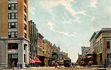

# Хьюстон

**Хьюстон** (англ. Houston) — четвёртый по количеству жителей город в Соединённых Штатах Америки и крупнейший город в штате Техас с населением 2 325 502 человека на 1.07.2018 года. Хьюстон является административным центром округа Харрис, а также главным экономическим центром агломерации Большого Хьюстона с общим населением 6 997 384 человек на 1.07.2018 года (5 место по США). Город располагается в 50 километрах от Мексиканского залива на прибрежной равнине.

Хьюстон был основан 30 августа 1836 года и включён в состав республики Техас 5 июня 1837 года, получив своё имя в честь Сэмюэла Хьюстона — главнокомандующего армией Техаса во время Техасской революции и президента Республики Техас. Быстрое развитие порта и железных дорог в XIX веке, а также начало добычи нефти и последовавшее развитие нефтяной промышленности в XX веке привели к быстрому росту населения. В 1960-е годы количество жителей превысило один миллион человек, а в 2000-е — два миллиона.

Город является ведущим мировым центром энергетической промышленности, а экономика города также представлена предприятиями в области аэронавтики, транспорта и здравоохранения. Важнейшими объектами для экономики и инфраструктуры города являются космический центр имени Линдона Джонсона, крупнейший американский по международным грузоперевозкам порт, хьюстонский судоходный канал, крупнейший в мире Техасский медицинский центр.

## Содержание

1. [История](#история)
    1. [Этимология, прозвища](#этимология-прозвища)
    1. [Основание](#основание)
    1. [XX век](#xx-век)
1. [Физико-географическая характеристика](#физико-географическая-характеристика)
    1. [Географическое положение](#географическое-положение)
    1. [Рельеф, внутренние воды](#рельеф-внутренние-воды)
    1. [Флора и фауна](#флора-и-фауна)
1. [Экономика](#экономика)
    1. [Общее состояние](#общее-состояние)
    1. [Энергетика и нефтехимия](#энергетика-и-нефтехимия)
    1. [Авиакосмическая промышленность](#авиакосмическая-промышленность)
1. [Население](#население)
    1. [Динамика и структура населения](#динамика-и-структура-населения)
    1. [Этнический и конфессиональный состав, языки](#этнический-и-конфессиональный-состав-языки)
1. [Средства массовой информации](#средства-массовой-информации)
1. [Города-побратимы](#города-побратимы)

## История

### Этимология, прозвища

*Сэмюэл Хьюстон*

Город назван в честь Сэмюэла Хьюстона — главнокомандующего армией Техаса во время Техасской революции (1835—1836) и президента Республики Техас (1836—1838, 1841—1844).

### Основание

*Allen’s Landing — место, где был основан город*

После окончания войны за независимость Техаса, в августе 1836 года предприниматели братья Август и Джон Аллены купили 26,9 км² земли вдоль реки Буффало-Байю, планируя основать на ней населённый пункт. Они хотели, чтобы будущий город стал столицей Техаса и крупным торговым центром.

Датой основания города принято считать 30 августа 1836 года, когда братья Аллены разместили объявление о появлении города. Город назвали в честь генерала Сэма Хьюстона, возглавлявшего армию техасцев в битве при Сан-Хасинто во время войны против Мексики, позже избранного президентом Техаса. На январь 1837 года в посёлке проживало всего 12 человек, однако через четыре месяца население возросло до 1 500 человек. 5 июня 1837 года город был включён в округ Гаррисберг (ныне Харрис) и стал временной столицей Республики Техас, которой оставался до 1839 года. Первым мэром Хьюстона стал Джеймс Холман.

### XX век

*Мэйн-Стрит в центре, 1908 год*

В 1900 году на Хьюстон обрушился Галвестонский ураган, продолжавшийся с 27 августа по 12 сентября. В пересчете на сегодняшний курс ущерб составил бы $526 млн, погибло 8 тысяч человек. В следующем году было найдено большое месторождение нефти вблизи города Бомонт, что послужило началом развития нефтяной промышленности в Техасе. В 1902 году президент США Теодор Рузвельт утвердил проект стоимостью в $1 млн на реконструкцию хьюстонского судоходного канала. К 1910 году численность населения города достигла 78 800 человек, почти в два раза превысив количество жителей проживавших в Хьюстоне в 1900 году. В 1914 году президент США Вудро Вильсон принял участие в открытии нового глубоководного порта Хьюстона, а через год был открыт хьюстонский судоходный канал.

В 1945 году было начато формирование Техасского медицинского центра. В конце 1940-х несколько пригородов были включены в городскую черту, в результате чего площадь Хьюстона увеличилась более чем в два раза. В 1950-е годы управления многих крупных (в основном нефтяных) компаний США переместились в Хьюстон, что благоприятно отразилось на экономике города, одним из поводов для переезда послужило массовое оснащение всех офисов кондиционерами.

>    Именно кондиционирование воздуха! Именно оно было основой для стремительного роста Хьюстона в 1950 году, когда он стал наиболее оснащённым кондиционерами городом в мире. Именно это стимулировало многие корпорации переместить свои штаб-квартиры в Хьюстон.

В 1962—1964 годах в двадцати пяти милях к югу от центра Хьюстона, на землях, переданных федеральному правительству университетом Райса, был построен Центр управления космическими кораблями, с 1973 года носящий имя Линдона Джонсона. В 1960-х годах население Хьюстона достигло миллиона человек.

## Физико-географическая характеристика

###  Географическое положение и климат

*Хьюстон со спутника Landsat 7*

Хьюстон расположен в 50 километрах от Мексиканского залива на прибрежной равнине. Значительная часть города была построена на лесных угодьях, болотах и прериях, они до сих пор сохранились в близлежащих районах около Хьюстона. Город расположен на территории, для которой обычны частые ливни и дожди, поэтому для Хьюстона наводнения — постоянная проблема. Высота города над уровнем моря в среднем 15 метров, самая высшая точка — северо-запад Хьюстона (38 метров). Площадь города составляет 1 653,87 км².

Весной и летом в городе жарко и влажно: средняя температура весной 21 °C, а летом — 28,8 °C. Из-за высокой температуры почти во всех транспортных средствах и зданиях установлены кондиционеры. Абсолютный максимум температуры был зарегистрирован в 2000 и 2011 годах, когда она составила 42,8 °C. На Хьюстон часто обрушиваются ураганы, самые крупные из которых за последние десятилетия — «Эллисон» и «Айк». Осень — достаточно тёплое время года, особенно сентябрь. Температура в этом месяце выше, чем в мае. Средняя температура осенью составляет 21,8 °C, а среднее количество осадков — самое высокое в году (359,7 мм). Зима тёплая. Самая низкая температура была зарегистрирована в 1930 году — −15 °C. Средняя температура зимой составляет 12,6 °C, а максимальная была зарегистрирована в 1986 году — 32,8 °C. 18 дней в году температура опускается ниже 0 °C. Обычно зимой осадки выпадают в виде дождя, но редко могут быть и в виде снега. Начиная с 1895 года, снег падал 35 раз, причём 21 раз устанавливался временный снежный покров.

*Дни с ясной и дождливой погодой в месяц (суммарно по часам)*

| Месяц | Янв | Фев | Мар | Апр | Май | Июн | Июл | Авг | Сен | Окт | Ноя | Дек | Год |
| ---   | --- | --- | --- | --- | --- | --- | --- | --- | --- | --- | --- | --- | --- |
| Солнечное сияние, день | 10 | 10 | 9 | 8 | 8 | 8 | 10 | 9 | 7 | 7 | 8 | 9 | 106 |
| Дождь, день | 14 | 12 | 12 | 10 | 10 | 14 | 13 | 12 | 10 | 9 | 10 | 12 | 136 |

### Рельеф, внутренние воды
Для почв Хьюстона характерно наличие осадочных горных пород и песка. На поверхности часты эрозии, на территории города находится около 300 разломов, их общая длина примерно 500 км. Один из них — Long Point–Eureka Heights fault system. Также есть уникальные отложения из смеси песков и глин, благодаря ним, через определённое время, из разлагающихся органических веществ образуются нефть и природный газ. На окраинах Хьюстона встречается чёрная плодородная почва, на которой растят рис, сою, зерновые культуры, овощи и разводят крупный рогатый скот, лошадей, свиней и домашнюю птицу. В городе и его окрестностях имеется очень малая вероятность сильного землетрясения, а самое сильное землетрясение магнитудой 3,8 было в 1910 году.

В Хьюстоне протекают четыре реки. Основная, Буффало-Байю, проходит через центр города и хьюстонский судоходный канал, и имеет три притока. Брес-Байю протекает вдоль района Техасского медицинского центра, Симс-Байю проходит через южную часть города, Уайт-Ок-Байю — через северную часть города. Судоходный канал следует дальше до Галвестона, вплоть до Мексиканского залива. В пригороде находятся два озера: Конро и Хьюстон, которые являются водохранилищем и служат городскими источниками воды. На территории города протекает множество подземных вод, которые раньше активно использовали для водоснабжения, но перестали из-за медленного движения земной поверхности.

###  Флора и фауна

*Парк Discovery green в центре Хьюстона*

В флоре и фауне округа Харрис преобладают виды животных и растений, обитающих в болотных местностях, так как значительная часть города построена на болотах и прериях.

Среди земноводных и пресмыкающихся наиболее известны хьюстонская жаба и техасская рогатая ящерица. Среди млекопитающих можно отметить рыжего волка, оцелота и канадскую выдру. Среди птиц замечаются американский клювач и белоголовый орлан. Численность большинства животных за последний век значительно сократилась в черте округа и находится под угрозой исчезновения из-за их истребления и ухудшения экологической обстановки. В городе также водятся комары, представляющие опасность человеку.

В городе и его пригородах растут сосны, пальмы и другие деревья, растущие в субтропическом климате. Среди растений, произрастающих в городе, можно выделить орхидеи и магнолии.

## Экономика

### Общее состояние

*Крупнейшие компании, базирующиеся в Хьюстоне по версии Fortune 500 на 2016 год*

Техас|	Компания|	США
---|---|---
3	|Phillips 66|	30
5	|Sysco|	57
8	|ConocoPhillips	|90
10	|Enterprise Products Partners	|104
12	|Halliburton	|117
13	|Plains All American Pipeline	|121
18	|Baker Hughes	|178
20	|National Oilwell Varco	|192
21	|Kinder Morgan	|198
24	|Waste Management	|221
25	|Occidental Petroleum	|225
29	|Group 1 Automotive	|267
34	|Cameron International	|319
35	|EOG Resources	|322
38	|Quanta Services	|352
39	|CenterPoint Energy	|363
40	|Targa Resources	|387
41	|Apache	|388
42	|Calpine	|402
45	|FMC Technologies	|410
49	|Marathon Oil	|438
52	|Spectra Energy	|493

*Хьюстонский судоходный канал*

Хьюстон является одним из ведущих городов мира в сферах добычи и переработки нефти и природного газа, из-за чего часто именуется «энергетической столицей мира», а также биомедицинских исследований и аэронавтики. Также Хьюстон имеет репутацию «зелёного города», так как половина электроэнергии производится с помощью солнечных и ветряных установок. Большую роль в транспортной сфере города играет порт. В Хьюстоне базируется 19 компаний из списка Fortune 500.

Международная исследовательская компания `Mercer` в 2019 году отвела Хьюстону 66 место в рейтинге самых удобных для проживания городов мира — наравне с американскими Лос-Анджелесом и Майами, и 86 место среди городов мира по стоимости жизни — между американским Далласом и австралийской Аделаидой. В категории «лучшие места для бизнеса и карьеры» по версии журнала `Forbes` за 2018 год Хьюстон занимает 38 место в США. Исследовательская компания `A.T. Kearney` поставила Хьюстон на 41 место в списке глобальных городов мира.

Минимальная заработная плата в Хьюстоне в час составляет $7,25 или $1 257 в месяц. Безработица на декабрь 2018 года составила 3,9 %. За чертой бедности находятся 9,2 % жителей. Средние доходы семьи на 2018 год по данным Forbes составляют $62 900, а средняя цена дома составляет $238 000.

###  Энергетика и нефтехимия

В Хьюстоне находится более 5 тысяч энергетических компаний, связанных с ведением бизнеса в этом регионе. В городе находятся штаб-квартиры множества энергетических и нефтяных компаний, входящих в список Fortune 500. Хьюстон является членом Всемирного партнёрства энергетических городов.

*Офис компании Chevron в Хьюстоне*

Одной из самых крупных компаний, обеспечивающих электроэнергией город, является компания CenterPoint Energy, которая поставляет электричество не только для Техаса, но и для Арканзаса, Луизианы, Миннесоты, Миссисипи, Оклахомы. Услугами компании пользуются более 5 млн человек. Другая крупная энергетическая компания Calpine занимает 35 место в Техасе и 336 в США в рейтинге Fortune 500. Корпорация обладает парком из 79 электростанций разных типов, разбросанных по всей территории США. Одна из них, Channel Energy Center расположена в самом Хьюстоне, на берегу судоходного канала, ещё одна, Baytown Energy Center — в пригороде Бейтаун. Максимальная мощность хьюстонской электростанции — 808 мегаватт (базовая — 723 МВт), бейтаунская электростанция в пиковом режиме способна производить 842 мегаватт (базовая электрическая мощность — 782 МВт). На территории метрополии Большого Хьюстона действует семь электростанций Calpine.

Хьюстон является одним из крупнейших производственных центров мира для нефтехимической промышленности. В городе располагаются больше 3 700 организаций, работающих в сфере нефтехимии. Также в хьюстонском регионе находятся 9 нефтеперерабатывающих заводов, перерабатывающих 2,3 миллиона баррелей в день, что составляет 13,2 % от всей переработки в США. Также в Хьюстоне имеется 719 предприятий по созданию химических и пласстмасовых изделий. В городе находится 17,5 % рабочих мест, занятых в сфере нефетехимии, из всех мест в США (112,6 тысячи из 643,3 тысяч). Город занимает лидирующее место по производству товаров из полиэтилена (38,7 % от всего производства в США), поливинилхлорида (35,9 %) и полипропилена (48,4 %).

### Авиакосмическая промышленность

 
*Космический центр им. Джонсона*
  
В Хьюстоне располагается космический центр имени Линдона Джонсона, представляющий собой научно-исследовательское и проектно-конструкторское предприятие, в котором работают 15000 человек (3000 инженеров и учёных, 12000 остальных рабочих). Всего в городе располагаются больше 150 организаций, имеющих дело с космической отраслью.

В районе Хьюстона находятся производственные мощности компании Lockheed Martin, а также офис программы строительства космического корабля «Орион» для NASA. В городе расположены производственные мощности компании Boeing, а также штаб-квартира подразделения «Boeing Space Exploration», занимающаяся исследованием космических систем. Мощности компании Beechcraft, находящиеся в аэропорте им. Хобби, занимаются техническим обслуживаем и ремонтом воздушных судов. Компания Barrios Technology выполняет контракты для NASA, связанные с кораблём «Орион», а также разрабатывает программное обеспечение для воздушных судов Boeing. Другими крупными исполнителями заказов NASA в Хьюстоне являются: Computer Sciences Corporation — техническое обслуживание и модификация самолётов, Jacobs Engineering Group — машиноведение, L-3 Communications — роботехника, MEI Technologies — электрические инженерные системы, Oceaneering International — скафандры и прилагающееся аппаратное обеспечение, Raytheon — лаборатория нейтральной плавучести и макеты космических кораблей, SAIC — безопасность и поддержка миссий, United Space Alliance — координационный центр информации, United Technologies — внекорабельная деятельность, Wyle Laboratories — космическая биология.

## Население

### Динамика и структура населения

*Перепись населения*

Год переписи	|Нас.|	%±
--- | --- | ---
1850|	2396	|—
1860|	4845	|102.2%
1870|	9332	|92.6%
1880|	16 513	|77%
1890|	27 557	|66.9%
1900|	44 633	|62%
1910|	78 800	|76.6%
1920|	138 276	|75.5%
1930|	292 352	|111.4%
1940|	384 514	|31.5%
1950|	596 163	|55%
1960|	938 219	|57.4%
1970|	1 232 802	|31.4%
1980|	1 595 138	|29.4%
1990|	1 630 553	|2.2%
2000|	1 953 631	|19.8%
2010|	2 100 263	|7.5%
Текущий 2017|	2 319 603	|10.4%

1850-2017 Переписи населения в 1790—2010 годах

*Этническая карта Хьюстона*

Согласно данным переписи населения США в 2010 году в городе проживало 2 100 263 человек, это на 7,5 % больше, чем в 2000 году. По оценке бюро переписи населения США на 1 июля 2018 года население составило 2 325 502 человека. Население города, начиная с его основания, постоянно растёт: в 1960-х годах оно достигло 1 млн жителей, а в 2000-х годах превысило 2 млн. Плотность населения в среднем составляет 1409 чел./км².

Возрастной состав населения: до 19 лет — 28,67 %; от 20 до 44 лет — 39,83 %; от 45 до 64 лет — 22,45 %; от 65 лет — 9,05 %. Средний возраст составляет 32 года. Количество женщин от всего населения — 49,82 %, мужчин — 50,18 %.

### Этнический и конфессиональный состав, языки

Из-за близости к Мексике доля выходцев из Латинской Америки составляет 43,8 % от всего населения. В абсолютных цифрах численность латиноамериканцев выросла с 731 до 920 тысяч человек за период 2000—2010 годов. Второе место в расовом составе города занимают белые люди, которые составляют 25,6 % от городского населения — их численность за десятилетие снизилась на 10 % с 602 до 538 тысяч человек. Также значительное население занимают афроамериканцы (23,1 %) и азиаты (6,15 %), чуть более 1 % составляют лица других национальностей. Иммиграция в Хьюстон в 2015 году составила 19 630 человек. 28 % жителей Хьюстона родились в другой стране: 72,5 % — из Латинской Америки, 18,9 % — из Азии, 3,9 % и 3,8 % — из Африки и Европы соответственно,0,2 % — из Океании. До 1960-х годов основными иммигрантами были люди из Европы, но с принятием в 1965 году нового закона об иммиграции и гражданстве,отменившего квоты по национальности, большинство иммигрантов стало приезжать из Латинской Америки, Азии и Африки. В 2005 году 240 тысяч жителей Нового Орлеана, на который обрушился ураган «Катрина», эвакуировались в Хьюстон. Впоследствии, до 40 тыс. человек осталось жить в городе.

50 % жителей города разговаривают только на английском языке. 34 % жителей разговаривают на испанском языке, по 1 % — на вьетнамском и китайском, по 0,2-0,4 % — на французском, урду, арабском, хинди, тагальском и корейском языках. Всего в городе разговаривают более чем на 100 языках.

18,44 % жителей исповедуют католицизм, 16,29 % — баптизм, 4,68 % — методизм, 2,86 % — ислам, 0,53 % — иудаизм. Всего исповедуют религию 58,4 % хьюстонцев,41,6 % — неверующие.

## Средства массовой информации

*Вещательный центр, откуда вещают радиостанции KUHT и KUHF*

В Хьюстоне вещают 19 телеканалов. Наиболее известные телеканалы являются аффилированными каналами крупных телекомпаний: KPRC-TV (NBC), KHOU-TV (CBS), KTRK-TV (ABC), KRIV (Fox), KIAH (The CW) и KTXH (MyNetworkTV). Телеканал KUHT является членом национальной общественной телевещательной службы PBS.

В Хьюстоне вещают 29 радиостанций. Одна из крупнейших радиостанций, KUHF, принадлежит Хьюстонской университетской системе.

`Houston Chronicle` — крупнейшая ежедневная газета Хьюстона и штата Техас, которая принадлежит нью-йоркской корпорации Hearst Corporation. В 2014 году ежедневный тираж газеты составлял 356 347 экземпляров, что ставит её на 16 место по тиражу среди всех газет США. До 1995 года существовала `Houston Post`,но была поглощена `Houston Chronicle`. На сегодняшний день единственным основным альтернативным городским изданием остаётся еженедельник `Houston Press`, его еженедельный тираж 2016 году составлял 43 810 экземпляров. В Хьюстоне выпускается газета `Houston Business Journal`, которая является частью компании American City Business Journals.

## Города-побратимы

Согласно городскому сайту, у Хьюстона 18 городов-побратимов (в последний раз этот список расширялся в 2015 году, когда к нему присоединилась Басра):
- Абу-Даби (ОАЭ)
- Абердин (Шотландия)
- Гуаякиль (Эквадор)
- Карачи (Пакистан)
- Баку (Азербайджан)
- Лейпциг (Германия)
- Ницца (Франция)
- Луанда (Ангола)
- Ставангер (Норвегия)
- Тайбэй (Тайвань)
- Стамбул (Турция)
- Перт (Австралия)
- Тюмень (Россия)
- Тампико (Мексика)
- Уэльва (Испания)
- Тиба (Япония)
- Шэньчжэнь (Китай)
- Басра (Ирак)
